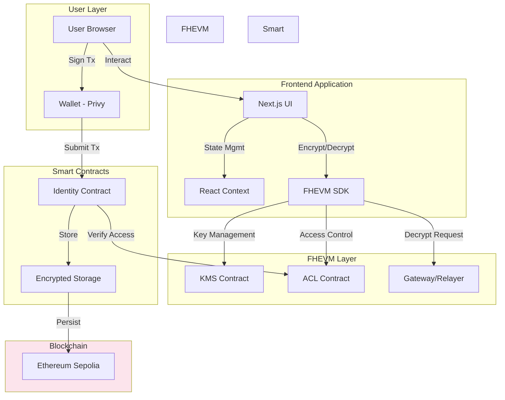
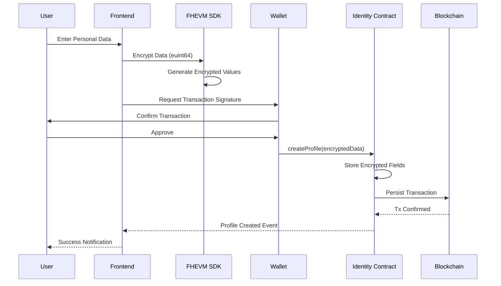
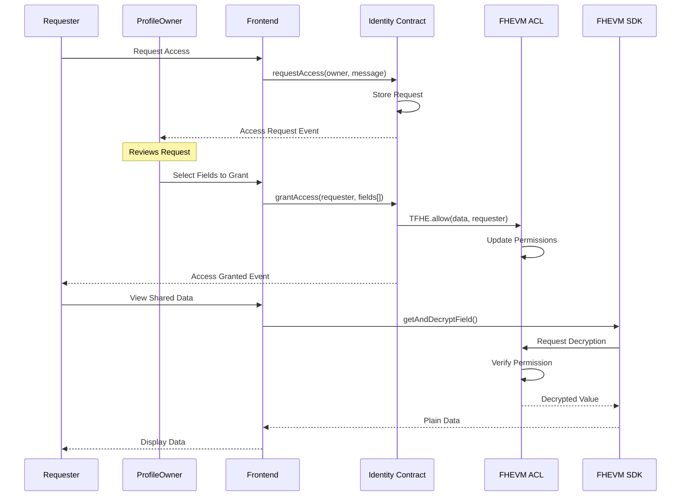
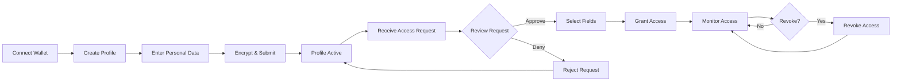
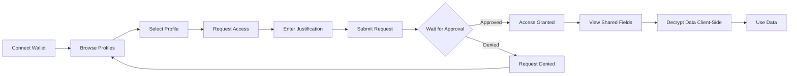
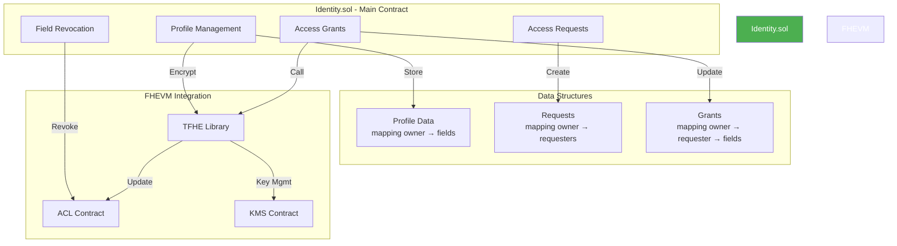
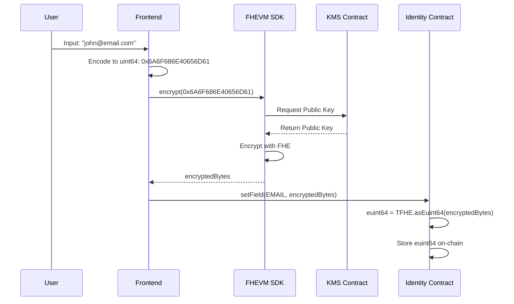
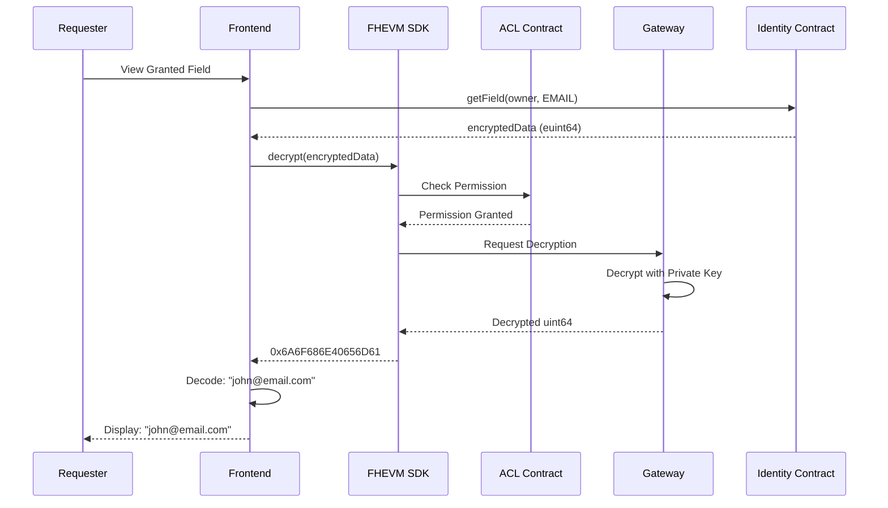

# Permid

## Privacy-Preserving Identity Management Platform

A fully encrypted, on-chain identity management system powered by Zama's FHEVM (Fully Homomorphic Encryption Virtual Machine) technology.

[](https://www.zama.ai/)
[](https://nextjs.org/)
[](https://www.typescriptlang.org/)

---

## Table of Contents

- [Executive Summary](#executive-summary)
- [Business Overview](#business-overview)
  - [Problem Statement](#problem-statement)
  - [Solution](#solution)
  - [Market Opportunity](#market-opportunity)
  - [Business Model](#business-model)
- [Technical Overview](#technical-overview)
  - [Architecture](#architecture)
  - [Technology Stack](#technology-stack)
  - [FHEVM Integration](#fhevm-integration)
  - [Security Model](#security-model)
- [System Architecture](#system-architecture)
- [FHEVM Implementation](#fhevm-implementation)
- [Smart Contract Documentation](#smart-contract-documentation)
- [Implementation Details](#implementation-details)
- [Data Encoding Strategy](#data-encoding-strategy)
- [Key Features](#key-features)
- [Use Cases](#use-cases)
- [Getting Started](#getting-started)
- [Performance Benchmarks](#performance-benchmarks)
- [Roadmap](#roadmap)
- [Metrics & KPIs](#metrics--kpis)
- [Competitive Advantages](#competitive-advantages)
- [License](#license)
- [Acknowledgments](#acknowledgments)
- [Contact & Links](#contact--links)

---

## Executive Summary

Permid is a privacy-preserving identity management platform that leverages Zama's Fully Homomorphic Encryption Virtual Machine (FHEVM) to provide unprecedented data privacy while maintaining on-chain verifiability.

**Key Highlights:**

- All personal data encrypted on-chain using FHEVM
- Selective disclosure - share only specific fields with verified requesters
- Granular permission management with instant revocation
- Automatic access revocation on profile updates - ensures data integrity
- Zero-knowledge architecture - no central authority can decrypt user data
- Immutable on-chain audit trail with complete privacy

---

## Business Overview

### Problem Statement

Traditional identity management systems face critical challenges:

1. **Centralized Data Breach Risk**: Personal data stored in centralized databases are honeypots for hackers
   - 422 million individuals affected by data breaches in 2022 alone
   - Average cost of a data breach: $4.35 million (IBM Security Report 2023)

2. **Lack of User Control**: Users have no control over how their data is used or shared
   - Companies sell user data without explicit consent
   - No granular control over what information is shared

3. **Privacy vs. Functionality Trade-off**: Current solutions either provide privacy OR functionality, not both
   - Encrypted storage means no on-chain verification
   - Public blockchains expose all data

4. **KYC/Compliance Overhead**: Organizations face massive compliance costs
   - $500M+ annual compliance spending for large financial institutions
   - Redundant KYC processes across different platforms

### Solution

Permid solves these problems using Zama's FHEVM technology:

| Traditional Identity | Permid (FHEVM-Powered) |
|---------------------|------------------------|
| Centralized storage | Decentralized on-chain storage |
| All-or-nothing sharing | Granular field-level control |
| Privacy OR functionality | Privacy AND functionality |
| Data breach risk | Zero-knowledge encryption |
| No audit trail | Immutable on-chain audit |

**Implementation:**

1. Users create profiles with personal data encrypted using FHEVM
2. Third parties request access to specific data fields
3. Users grant or deny access to individual fields
4. Authorized parties decrypt data client-side using FHEVM
5. Users can revoke access at any time

### Market Opportunity

**Total Addressable Market (TAM)**: $30B+ by 2027

**Target Markets:**

1. **Digital Identity Management** ($25B by 2027)
   - Self-sovereign identity platforms
   - Decentralized ID solutions
   - KYC/AML service providers

2. **Healthcare Data Privacy** ($8B by 2026)
   - Patient record management
   - HIPAA-compliant data sharing
   - Medical research with privacy

3. **Financial Services Compliance** ($15B by 2025)
   - KYC/AML verification
   - Credit scoring with privacy
   - Cross-border identity verification

4. **HR/Recruitment** ($5B+)
   - Background verification
   - Credential verification
   - Employment history validation

### Business Model

**Revenue Streams:**

1. **Transaction Fees** (Primary)
   - Small fee for each access request: $0.10 - $2.00
   - Volume-based pricing for enterprises

2. **Enterprise Licensing**
   - SaaS subscription for organizations: $1,000 - $50,000/month
   - White-label solutions: $100,000+ annually

3. **API Access**
   - Developer tiers: $100 - $5,000/month
   - Custom enterprise integrations

4. **Premium Features**
   - Advanced analytics: $10/month per user
   - Bulk verification services: $0.50 per verification

**Go-to-Market Strategy:**

- **Phase 1** (Months 1-6): Developer adoption via hackathons and grants
- **Phase 2** (Months 7-12): Partner with 3-5 DeFi protocols for KYC
- **Phase 3** (Year 2): Enterprise pilots with HR/recruitment firms
- **Phase 4** (Year 3): Healthcare and financial services expansion

---

## Technical Overview

### Architecture

Permid uses a three-tier architecture optimized for privacy and performance:

```
┌─────────────────────────────────────────────────────────────┐
│                     Frontend Layer                          │
│  ┌──────────────┬───────────────┬─────────────────┐        │
│  │   Next.js    │   React UI    │  Privy Wallet   │        │
│  │   App Router │   Components  │   Integration   │        │
│  └──────────────┴───────────────┴─────────────────┘        │
└─────────────────────────────────────────────────────────────┘
                           ↕
┌─────────────────────────────────────────────────────────────┐
│                  Encryption Layer (FHEVM)                   │
│  ┌──────────────────────────────────────────────────┐       │
│  │  Zama FHEVM SDK - Client-Side Encryption         │       │
│  │  • euint64 data types for encrypted integers     │       │
│  │  • Client-side key generation                    │       │
│  │  • Decrypt with user permission                  │       │
│  └──────────────────────────────────────────────────┘       │
└─────────────────────────────────────────────────────────────┘
                           ↕
┌─────────────────────────────────────────────────────────────┐
│                   Smart Contract Layer                      │
│  ┌─────────────────┬──────────────────┬──────────────┐     │
│  │  Identity.sol   │   Data Types     │  ACL System  │     │
│  │  • Profile mgmt │   • euint64      │  • Request   │     │
│  │  • Access ctrl  │   • Encrypted    │  • Grant     │     │
│  │  • Field grants │   • On-chain     │  • Revoke    │     │
│  └─────────────────┴──────────────────┴──────────────┘     │
└─────────────────────────────────────────────────────────────┘
                           ↕
┌─────────────────────────────────────────────────────────────┐
│                  Blockchain Network                         │
│            Ethereum Sepolia + FHEVM Coprocessor             │
└─────────────────────────────────────────────────────────────┘
```

### Technology Stack

**Frontend:**
- **Framework**: Next.js 15.5 (App Router)
- **Language**: TypeScript 5.0
- **UI Library**: React 18 with Tailwind CSS 3.4
- **Wallet**: Privy.io for seamless wallet connection
- **State Management**: React Context API
- **Encryption**: Zama FHEVM SDK (Relayer SDK)

**Smart Contracts:**
- **Language**: Solidity 0.8.24
- **Framework**: Hardhat with TypeScript
- **Libraries**:
  - `fhevm` v0.5.0 - FHEVM core library
  - `fhevm-contracts` - Pre-built FHEVM utilities
- **Network**: Ethereum Sepolia (testnet)

**Infrastructure:**
- **Hosting**: Vercel (Frontend)
- **RPC**: Public Ethereum nodes
- **IPFS**: (Future) For additional metadata storage

### FHEVM Integration

**How We Use FHEVM:**

1. **Data Encryption** (`euint64` type)
```solidity
// Store encrypted personal data on-chain
mapping(address => mapping(DataField => euint64)) private encryptedData;

// Example: Storing encrypted email
function setField(DataField field, bytes calldata encryptedValue) external {
    euint64 encrypted = TFHE.asEuint64(encryptedValue);
    encryptedData[msg.sender][field] = encrypted;
}
```

2. **Access Control with ACL**
```solidity
// Grant access to specific fields
function grantAccess(address requester, DataField[] calldata fields) external {
    for (uint i = 0; i < fields.length; i++) {
        euint64 data = encryptedData[msg.sender][fields[i]];
        TFHE.allowThis(data);
        TFHE.allow(data, requester);
    }
}
```

3. **Client-Side Decryption**
```typescript
// Frontend: Decrypt with user permission
const value = await getAndDecryptField(profileAddress, fieldId);
const displayValue = uint64ToString(value); // Decode to readable format
```

**FHEVM Advantages:**

- **Computation on Encrypted Data**: Verify conditions without decryption
- **Granular Access Control**: Field-level permissions
- **Secure Multi-Party Computation**: Share data without revealing to intermediaries
- **Blockchain Transparency**: Audit trail without privacy loss

### Security Model

**Threat Model & Mitigations:**

| Threat | Traditional Approach | Permid (FHEVM) |
|--------|---------------------|----------------|
| Database Breach | All data exposed | Encrypted on-chain, attacker gets gibberish |
| Man-in-the-Middle | Intercept plaintext | All data encrypted in transit and at rest |
| Insider Attack | Admin access to all data | Even contract owner cannot decrypt |
| Smart Contract Exploit | Logic bugs expose data | Data remains encrypted even if exploited |
| Front-running | MEV bots can see data | Encrypted transactions hide data |

**Security Features:**

1. **End-to-End Encryption**: Data encrypted before leaving user's device
2. **Zero-Knowledge Storage**: Blockchain stores only encrypted data
3. **Granular Permissions**: Users control access at field level
4. **Revocable Access**: Instant revocation via ACL updates
5. **Audit Trail**: All access requests/grants logged on-chain
6. **No Central Authority**: No single point of failure

---

## System Architecture

### System Architecture Diagram



### Data Flow - Creating a Profile



### Access Request & Grant Flow



### User Journey - Profile Owner



### User Journey - Data Requester



### Smart Contract Architecture



---

## FHEVM Implementation

### Understanding Fully Homomorphic Encryption

**What is FHE?**
Fully Homomorphic Encryption allows computations to be performed on encrypted data without decrypting it first.

**Traditional Encryption vs FHEVM:**

```
Traditional Encryption:
Data → Encrypt → ████ → MUST Decrypt → Compute → Re-encrypt → ████

FHEVM (Fully Homomorphic):
Data → Encrypt → ████ → Compute on ████ directly → ████ Result
```

### FHEVM Data Types in Permid

```solidity
// euint64: Encrypted 64-bit unsigned integer
euint64 encryptedEmail;    // Stores encoded text (8 chars max)
euint64 encryptedDOB;      // Stores timestamp
euint64 encryptedAge;      // Stores numeric age

// Future expansion:
ebool encryptedVerified;   // Encrypted boolean
euint32 encryptedScore;    // Smaller encrypted integer
```

### Encryption Flow



### Decryption Flow



### ACL (Access Control List) System

**How FHEVM ACL Works:**

1. **Initial State**: Encrypted data is accessible only to contract
```solidity
euint64 data = TFHE.asEuint64(encryptedValue);
// By default, only contract can access
```

2. **Grant Access**: Allow specific address to decrypt
```solidity
TFHE.allow(data, requesterAddress);
// Now requesterAddress can decrypt this specific euint64
```

3. **Revoke Access**: Remove permission
```solidity
// Note: Current FHEVM doesn't have direct revoke
// Workaround: Re-encrypt with new key and grant to others
```

### TFHE Library Functions Used

```solidity
import "fhevm/lib/TFHE.sol";

// Encryption
euint64 encrypted = TFHE.asEuint64(encryptedInput);

// Access Control
TFHE.allow(encrypted, address);      // Grant access
TFHE.allowThis(encrypted);           // Grant to contract itself

// Comparisons (on encrypted data!)
ebool isEqual = TFHE.eq(encrypted1, encrypted2);
ebool isGreater = TFHE.gt(encrypted1, encrypted2);

// Arithmetic (on encrypted data!)
euint64 sum = TFHE.add(encrypted1, encrypted2);
euint64 product = TFHE.mul(encrypted1, encrypted2);
```

---

## Smart Contract Documentation

### Contract Specification

**Contract Address (Sepolia):** `0x61a6D9B953b4AE67299FEAC62FeAa3506fd13Ca8`

**Verified on Etherscan:** [View on Etherscan](https://sepolia.etherscan.io/address/0x61a6D9B953b4AE67299FEAC62FeAa3506fd13Ca8)

### Data Structures

#### DataField Enum

Represents different types of personal data that can be stored.

```solidity
enum DataField {
    EMAIL,      // 0 - Email address
    DOB,        // 1 - Date of birth
    NAME,       // 2 - Full name
    ID_NUMBER,  // 3 - Government ID number
    LOCATION,   // 4 - Physical location/address
    EXPERIENCE, // 5 - Years of experience
    COUNTRY     // 6 - Country of residence
}
```

**Storage Format:**
All fields are stored as `euint64` (encrypted 64-bit unsigned integers).

#### Profile Struct

```solidity
struct Profile {
    bool exists;
    mapping(DataField => euint64) encryptedData;
}
```

#### AccessRequest Struct

```solidity
struct AccessRequest {
    string message;    // Justification for access
    bool exists;       // Whether request exists
}
```

### State Variables

#### Main Storage Mappings

```solidity
// User profiles
mapping(address => Profile) private profiles;

// List of all profile owners
mapping(address => address[]) private profileOwners;

// Access requests: owner => requester => request details
mapping(address => mapping(address => AccessRequest)) private accessRequests;

// Granted access: owner => requester => field => granted
mapping(address => mapping(address => mapping(DataField => bool))) private grantedAccess;

// Incoming request tracking: owner => list of requester addresses
mapping(address => address[]) private incomingRequests;

// Outgoing request tracking: requester => list of owner addresses
mapping(address => address[]) private outgoingRequests;
```

### Events

#### Profile Events

```solidity
event ProfileCreated(address indexed owner);
```
Emitted when a new profile is created.

#### Data Events

```solidity
event FieldSet(address indexed owner, DataField indexed field);
```
Emitted when a profile field is set or updated.

#### Access Control Events

```solidity
event AccessRequested(
    address indexed owner,
    address indexed requester,
    string message
);
```
Emitted when someone requests access to a profile.

```solidity
event AccessGranted(
    address indexed owner,
    address indexed requester,
    DataField[] fields
);
```
Emitted when profile owner grants access to specific fields.

```solidity
event AccessRevoked(
    address indexed owner,
    address indexed requester
);
```
Emitted when profile owner revokes all access from a requester.

### Functions

#### Profile Management

##### createProfile

```solidity
function createProfile() external
```

Creates a new profile for the caller.

**Requirements:**
- Profile must not already exist

**Events:**
- Emits `ProfileCreated`

**Example:**
```typescript
await identityContract.createProfile();
```

##### setField

```solidity
function setField(
    DataField field,
    bytes calldata encryptedValue
) external
```

Sets or updates an encrypted field in the caller's profile.

**Parameters:**
- `field`: The field type to set (EMAIL, DOB, etc.)
- `encryptedValue`: FHEVM-encrypted data as bytes

**Requirements:**
- Profile must exist
- Must be called by profile owner

**Events:**
- Emits `FieldSet`

**Example:**
```typescript
// Frontend encryption
const encrypted = await fhevmInstance.encrypt64(valueAsUint64);

// Contract call
await identityContract.setField(
  DataField.EMAIL,
  encrypted
);
```

##### setMultipleFields

```solidity
function setMultipleFields(
    DataField[] calldata fields,
    bytes[] calldata encryptedValues
) external
```

Batch sets multiple fields in a single transaction.

**Parameters:**
- `fields`: Array of field types
- `encryptedValues`: Array of encrypted values (must match fields length)

**Requirements:**
- Profile must exist
- Arrays must have same length
- Must be called by profile owner

**Events:**
- Emits `FieldSet` for each field

##### updateProfile

```solidity
function updateProfile(
    externalEuint64 encryptedEmail,
    externalEuint64 encryptedDob,
    externalEuint64 encryptedName,
    externalEuint64 encryptedIdNumber,
    externalEuint64 encryptedLocation,
    externalEuint64 encryptedExperience,
    externalEuint64 encryptedCountry,
    bytes calldata inputProof
) external
```

Updates all fields in the caller's profile with new encrypted values.

**Parameters:**
- `encryptedEmail` through `encryptedCountry`: FHEVM-encrypted data for all 7 fields
- `inputProof`: Cryptographic proof for batch encryption

**Requirements:**
- Profile must exist
- Must be called by profile owner

**Automatic Access Revocation:**
When a profile is updated, the smart contract **automatically revokes all previously granted access** to ensure users with old data permissions cannot decrypt the new data. This is handled atomically within the contract.

**Events:**
- Emits `ProfileUpdated`
- Emits `AccessRevoked` for each requester who had access

**Example:**
```typescript
// Encrypt all fields
const encryptedFields = await encryptAllFields(profileData);

// Update profile - revocation happens automatically
await identityContract.updateProfile(
  encryptedFields.email,
  encryptedFields.dob,
  encryptedFields.name,
  encryptedFields.idNumber,
  encryptedFields.location,
  encryptedFields.experience,
  encryptedFields.country,
  inputProof
);

// All previous access grants are now revoked
// Users must re-request access to view updated data
```

**Why Automatic Revocation?**
- **Data Integrity**: Prevents users from accessing stale data after updates
- **Atomic Operation**: Update + revoke in single transaction (cannot be bypassed)
- **Security**: Enforced at contract level, not reliant on frontend logic

#### Access Request Management

##### requestAccess

```solidity
function requestAccess(
    address profileOwner,
    string calldata message
) external
```

Requests access to another user's profile.

**Parameters:**
- `profileOwner`: Address of the profile to request access to
- `message`: Justification for the access request

**Requirements:**
- Profile must exist
- Cannot request access to own profile
- Message must not be empty

**Events:**
- Emits `AccessRequested`

**Example:**
```typescript
await identityContract.requestAccess(
  profileOwnerAddress,
  "I need to verify your credentials for job application #123"
);
```

##### grantAccess

```solidity
function grantAccess(
    address requester,
    DataField[] calldata fields
) external
```

Grants a requester access to specific encrypted fields.

**Parameters:**
- `requester`: Address to grant access to
- `fields`: Array of fields to grant access to

**Requirements:**
- Profile must exist
- Must be called by profile owner
- Access request must exist from requester
- At least one field must be specified

**Effects:**
- Updates `grantedAccess` mapping
- Calls `TFHE.allow()` for each field to update FHEVM ACL

**Events:**
- Emits `AccessGranted`

**Example:**
```typescript
await identityContract.grantAccess(
  requesterAddress,
  [DataField.EMAIL, DataField.NAME, DataField.COUNTRY]
);
```

##### revokeAccess

```solidity
function revokeAccess(address requester) external
```

Revokes all access from a specific requester.

**Parameters:**
- `requester`: Address to revoke access from

**Requirements:**
- Profile must exist
- Must be called by profile owner

**Effects:**
- Removes request from `incomingRequests`
- Clears all field grants in `grantedAccess`
- Removes from requester's `outgoingRequests`

**Events:**
- Emits `AccessRevoked`

**Example:**
```typescript
await identityContract.revokeAccess(requesterAddress);
```

#### View Functions (No Gas Cost)

##### hasProfile

```solidity
function hasProfile(address user) external view returns (bool)
```

Checks if an address has created a profile.

**Returns:** `true` if profile exists, `false` otherwise

##### getField

```solidity
function getField(
    address owner,
    DataField field
) external view returns (euint64)
```

Retrieves an encrypted field value.

**Parameters:**
- `owner`: Profile owner's address
- `field`: Field to retrieve

**Returns:** Encrypted `euint64` value

**Note:** Can only be decrypted if caller has been granted access via FHEVM ACL

**Example:**
```typescript
const encryptedField = await identityContract.getField(
  ownerAddress,
  DataField.EMAIL
);

// Decrypt client-side (if you have permission)
const decrypted = await fhevmInstance.decrypt(encryptedField);
```

##### getMyProfile

```solidity
function getMyProfile() external view returns (euint64[7] memory)
```

Returns all encrypted fields of caller's own profile.

**Returns:** Array of 7 encrypted field values (one for each DataField)

**Note:** Owner doesn't need ACL permission to view own encrypted data

##### getAllProfiles

```solidity
function getAllProfiles() external view returns (address[] memory)
```

Returns array of all profile owner addresses.

**Returns:** Array of addresses

**Example:**
```typescript
const allProfiles = await identityContract.getAllProfiles();
console.log(`Total profiles: ${allProfiles.length}`);
```

##### getMyIncomingRequests

```solidity
function getMyIncomingRequests()
    external
    view
    returns (address[] memory)
```

Returns addresses of all users who requested access to caller's profile.

**Returns:** Array of requester addresses

##### getMyOutgoingRequests

```solidity
function getMyOutgoingRequests()
    external
    view
    returns (address[] memory)
```

Returns addresses of all profiles caller has requested access to.

**Returns:** Array of profile owner addresses

##### getAccessRequestStatus

```solidity
function getAccessRequestStatus(
    address profileOwner,
    address requester
) external view returns (
    bool exists,
    bool pending,
    bool granted,
    string memory message
)
```

Gets detailed status of an access request.

**Parameters:**
- `profileOwner`: Profile owner's address
- `requester`: Requester's address

**Returns:**
- `exists`: Whether a request was made
- `pending`: Whether request is pending (not granted, not denied)
- `granted`: Whether any access has been granted
- `message`: Original request message

---

## Implementation Details

### Smart Contract Structure

**File: `contracts/Identity.sol`**

```solidity
// SPDX-License-Identifier: MIT
pragma solidity ^0.8.24;

import "fhevm/lib/TFHE.sol";
import "fhevm/gateway/GatewayCaller.sol";

contract Identity is GatewayCaller {
    // Data field types
    enum DataField {
        EMAIL,      // 0
        DOB,        // 1
        NAME,       // 2
        ID_NUMBER,  // 3
        LOCATION,   // 4
        EXPERIENCE, // 5
        COUNTRY     // 6
    }

    // Profile structure
    struct Profile {
        bool exists;
        mapping(DataField => euint64) encryptedData;
    }

    // Access request structure
    struct AccessRequest {
        string message;
        bool exists;
    }

    // Storage
    mapping(address => Profile) private profiles;
    mapping(address => address[]) private profileOwners;
    mapping(address => mapping(address => AccessRequest)) private accessRequests;
    mapping(address => mapping(address => mapping(DataField => bool))) private grantedAccess;

    // Events
    event ProfileCreated(address indexed owner);
    event FieldSet(address indexed owner, DataField field);
    event AccessRequested(address indexed owner, address indexed requester);
    event AccessGranted(address indexed owner, address indexed requester);
    event AccessRevoked(address indexed owner, address indexed requester);

    // Core Functions
    function createProfile() external;
    function setField(DataField field, bytes calldata encryptedValue) external;
    function requestAccess(address profileOwner, string calldata message) external;
    function grantAccess(address requester, DataField[] calldata fields) external;
    function revokeAccess(address requester) external;
    function getField(address owner, DataField field) external view returns (euint64);
}
```

### Frontend Architecture

**Key Components:**

1. **Contexts**
   - `FhevmContext`: Manages FHEVM SDK initialization
   - `SnackbarContext`: Global notifications
   - `PrivyProvider`: Wallet connection management

2. **Hooks**
   - `useIdentity`: Main hook for contract interactions
   - `useFhevm`: Access to FHEVM instance

3. **Pages**
   - `/` - Homepage with profile browsing
   - `/profile/create` - Create new profile
   - `/profile/[address]` - View profile & request access
   - `/my-profile` - View and edit own profile
   - `/dashboard` - Manage incoming/outgoing requests

4. **Utilities**
   - `encoding.ts`: Convert between euint64 and readable formats
   - `init.ts`: FHEVM SDK initialization

---

## Data Encoding Strategy

### Challenge

FHEVM `euint64` only stores 64-bit unsigned integers, but we need to store:
- Text (emails, names)
- Dates
- Long strings

### Solution: Multi-Layer Encoding

#### 1. Short Text (8 characters or less)

```typescript
function stringToUint64(str: string): bigint {
  // Encode up to 8 ASCII characters into uint64
  const bytes = new TextEncoder().encode(str.slice(0, 8));
  let value = 0n;

  for (let i = 0; i < bytes.length; i++) {
    // Pack bytes from left to right
    value = (value << 8n) | BigInt(bytes[i]);
  }

  return value;
}

// Example: "john@xyz" → 0x6A6F686E4078797A
```

#### 2. Dates

```typescript
function dateToUint64(date: Date): bigint {
  // Store as Unix timestamp
  return BigInt(Math.floor(date.getTime() / 1000));
}

// Example: 2024-01-15 → 1705276800
```

#### 3. Numbers

```typescript
function numberToUint64(num: number): bigint {
  // Direct conversion
  return BigInt(num);
}

// Example: Age 25 → 25
```

#### 4. Long Text (Future Enhancement)

**Option A: Split into multiple euint64**
```solidity
mapping(address => mapping(DataField => euint64[])) private longData;

// "verylongemail@example.com" split into:
// [0x766572796C6F6E67, 0x656D61696C406578, 0x616D706C652E636F, 0x6D00000000000000]
```

**Option B: Store IPFS hash**
```solidity
mapping(address => mapping(DataField => euint64)) private ipfsHashPtr;

// Store IPFS hash as euint64, actual data on IPFS encrypted
```

### Decoding

```typescript
function uint64ToString(value: bigint): string {
  const bytes: number[] = [];
  let val = value;

  // Extract bytes from right to left
  while (val > 0n) {
    bytes.unshift(Number(val & 0xFFn));
    val = val >> 8n;
  }

  return new TextDecoder().decode(new Uint8Array(bytes));
}

function uint64ToDate(value: bigint): string {
  const timestamp = Number(value) * 1000;
  return new Date(timestamp).toISOString().split('T')[0];
}

function uint64ToNumber(value: bigint): number {
  return Number(value);
}
```

---

## Key Features

### For Users (Profile Owners)

- **Create Encrypted Profiles**: Store personal data encrypted on-chain
- **Update with Automatic Revocation**: Profile updates automatically revoke all previous access grants
- **Receive Access Requests**: See who wants access and why
- **Granular Control**: Approve specific fields, not all-or-nothing
- **Instant Revocation**: Remove access anytime
- **Audit Trail**: See all access requests and grants
- **Zero Trust**: No one can decrypt without your permission

### For Organizations (Data Requesters)

- **Request Verified Data**: Access only what you need
- **Compliance Ready**: Built-in audit trail for regulations
- **Reduced Liability**: No storage of sensitive plaintext data
- **Instant Verification**: Real-time access to approved data
- **Cost Efficient**: No redundant KYC processes

### Technical Features

- **FHEVM-Powered**: Fully homomorphic encryption
- **On-Chain Privacy**: Encrypted data on public blockchain
- **Field-Level Granularity**: Control access to individual fields
- **Revocable Permissions**: ACL-based access control
- **Client-Side Decryption**: Keys never leave user device
- **Gas Optimized**: Efficient FHEVM operations

---

## Use Cases

### 1. Decentralized KYC for DeFi

**Scenario**: A DeFi protocol needs to verify user identity for compliance.

**Traditional Flow**:
- User uploads documents to centralized KYC provider
- Provider stores sensitive data in database (breach risk)
- Protocol trusts third-party verification

**Permid Flow**:
1. User creates Permid profile with verified credentials
2. DeFi protocol requests access to required fields (e.g., country, age)
3. User approves only necessary fields
4. Protocol verifies on-chain without storing data
5. User can revoke access after transaction

**Benefits**:
- Reusable across protocols
- No data stored by protocol
- User maintains control
- Instant revocation

### 2. HR Background Verification

**Scenario**: Employer needs to verify candidate's education and work history.

**Permid Flow**:
1. Candidate stores verified credentials in Permid
2. Employer requests access to education + experience fields
3. Candidate approves for 30-day review period
4. Employer verifies encrypted data on-chain
5. Access auto-revokes after hiring decision

**Benefits**:
- No redundant verification per job application
- Instant verification
- Privacy-preserved references
- Immutable credentials

### 3. Healthcare Data Sharing

**Scenario**: Patient needs to share medical records with specialist.

**Permid Flow**:
1. Patient stores encrypted health records in Permid
2. Specialist requests access to specific medical fields
3. Patient grants temporary access
4. Specialist decrypts only approved records
5. Patient revokes access after treatment

**Benefits**:
- HIPAA-compliant data sharing
- No central database breach risk
- Patient retains full control
- Audit trail for compliance

### 4. Cross-Border Identity Verification

**Scenario**: International transaction requires identity verification.

**Permid Flow**:
1. User creates Permid profile with government-verified ID
2. Service provider in different country requests verification
3. User approves nationality + ID verification fields
4. Provider verifies without storing sensitive data
5. Immutable proof of verification on-chain

**Benefits**:
- No cross-border data transfer restrictions
- Privacy-compliant in all jurisdictions
- Instant verification
- Reduced fraud

---

## Getting Started

### Prerequisites

- Node.js 18+
- npm or yarn
- MetaMask or compatible Web3 wallet
- Sepolia testnet ETH

### Installation

```bash
# Clone the repository
git clone https://github.com/yourusername/permid.git
cd permid/identity-frontend

# Install dependencies
npm install

# Set up environment variables
cp .env.example .env.local
# Edit .env.local with your configuration

# Run development server
npm run dev
```

### Environment Variables

```env
# Privy Configuration
NEXT_PUBLIC_PRIVY_APP_ID=your_privy_app_id

# Blockchain Configuration
NEXT_PUBLIC_CHAIN_ID=11155111  # Sepolia
NEXT_PUBLIC_CONTRACT_ADDRESS=0x61a6D9B953b4AE67299FEAC62FeAa3506fd13Ca8

# Optional: Analytics, etc.
```

### Deploy Smart Contracts

```bash
cd contracts

# Install dependencies
npm install

# Compile contracts
npx hardhat compile

# Deploy to Sepolia
npx hardhat run scripts/deploy.ts --network sepolia

# Verify on Etherscan
npx hardhat verify --network sepolia DEPLOYED_ADDRESS
```

### Usage

1. **Connect Wallet**: Click "Connect Wallet" and approve with MetaMask
2. **Create Profile**: Navigate to "Create Profile" and enter your data
3. **Browse Profiles**: View all registered profiles on the homepage
4. **Request Access**: Click on a profile and request access with a message
5. **Manage Requests**: Go to Dashboard to approve/deny incoming requests
6. **View Shared Data**: Access granted data will decrypt automatically

---

## Performance Benchmarks

### Frontend Performance

**Metrics** (on mid-range laptop):

| Operation | Time | Notes |
|-----------|------|-------|
| FHEVM SDK Load | ~2-3s | One-time on app load |
| FHEVM Initialization | ~3-5s | One-time setup |
| Encrypt Field (client) | ~50-100ms | Per field |
| Decrypt Field (client) | ~200-500ms | Via gateway |
| Sign Transaction | ~2-3s | User interaction |
| Transaction Confirmation | ~15-30s | Sepolia block time |

### Scalability

**Current (Sepolia Testnet):**
- Max profiles: Unlimited
- Max fields per profile: 7 (expandable)
- Throughput: ~2-3 TPS (Sepolia limitation)

**Future Scaling:**
- **Mainnet L1**: ~12-15 TPS
- **L2 (Optimism/Arbitrum)**: ~2000-4000 TPS
- Rollup-specific optimizations
- State channel for instant grants/revokes
- ZK-SNARK proofs for batch operations

---

## Roadmap

### Phase 1: MVP (Current)
- [x] Core FHEVM integration
- [x] Basic profile creation and updates
- [x] Access request/grant system
- [x] Client-side decryption
- [x] Revocation mechanism
- [x] Automatic access revocation on profile update
- [x] Sepolia testnet deployment

### Phase 2: Enhanced Features
- [ ] Multi-field support expansion (15+ fields)
- [ ] Batch operations for efficiency
- [ ] Time-based access expiration
- [ ] Conditional access grants
- [ ] Advanced field encryption (ebool, euint32)
- [ ] IPFS integration for large data

### Phase 3: Enterprise Features
- [ ] Organization accounts (multi-sig)
- [ ] Bulk verification APIs
- [ ] Webhook notifications
- [ ] Custom field definitions
- [ ] Advanced analytics dashboard
- [ ] SDK for developers

### Phase 4: Scaling & Optimization
- [ ] Mainnet deployment
- [ ] L2 integration (Arbitrum, Optimism)
- [ ] Gas optimization techniques
- [ ] Caching layer for performance
- [ ] Mobile app (React Native)
- [ ] Browser extension

### Phase 5: Ecosystem Growth
- [ ] Partner integrations (DeFi, DEX, DAOs)
- [ ] Credential marketplace
- [ ] Reputation system
- [ ] Decentralized governance
- [ ] Cross-chain identity bridges
- [ ] AI-powered fraud detection (with FHE)

---

## Metrics & KPIs

### Current Status (Testnet)

- **Smart Contract**: Deployed on Sepolia at `0x61a6D9B953b4AE67299FEAC62FeAa3506fd13Ca8`
- **Profiles Created**: Testing phase
- **Access Requests**: Functional
- **Key Features**: Profile updates automatically revoke previous access grants

### Target Metrics (12 Months)

- **Users**: 10,000+ profiles
- **Transactions**: 100,000+ access requests
- **Partnerships**: 10+ DeFi protocols integrated
- **Enterprise Pilots**: 3+ organizations
- **TVL**: $1M+ in staked verification bonds

---

## Competitive Advantages

| Feature | Permid (FHEVM) | Centralized ID | Public Blockchain ID | ZK-Based Solutions |
|---------|----------------|----------------|---------------------|-------------------|
| **Privacy** | Full encryption | Plaintext storage | Public data | Zero-knowledge |
| **On-Chain Verifiable** | Yes | Off-chain | Yes | Limited |
| **Granular Control** | Field-level | All-or-nothing | All public | Proof-based |
| **Instant Revocation** | Yes | Slow | Immutable | Complex |
| **No Trusted Setup** | No setup needed | Centralized | Permissionless | Trusted setup |
| **Compute on Encrypted** | FHE enables | No | No | Limited |

---

**Open for Contributors:**
We welcome contributions! See CONTRIBUTING.md for guidelines.

---

## License

This project is licensed under the MIT License - see the LICENSE file for details.

---

## Acknowledgments

- **Zama** for developing FHEVM and providing excellent documentation
- **Privy** for seamless wallet integration
- **Ethereum Foundation** for Sepolia testnet
- **Open-source community** for various tools and libraries

---

## Contact & Links

- **Website**: https://permid-tau.vercel.app
- **GitHub**: https://github.com/haseoleonard/permid
- **Twitter**: https://x.com/Sei_myname150
- **Email**: minhn101500@gmail.com

---

**Built with Zama FHEVM**

*Empowering users with true data ownership and privacy.*